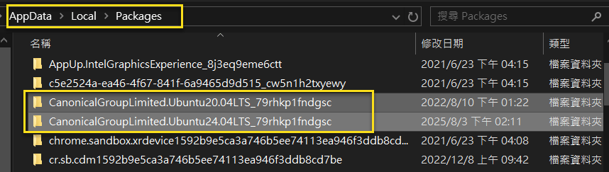
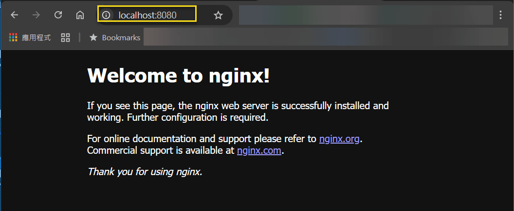
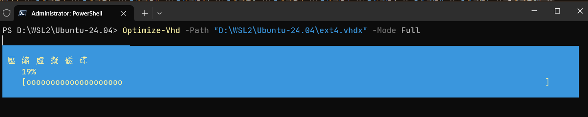

<!-- Start Document Outline -->

* [WSL2 磁碟空間管理](#wsl2-磁碟空間管理)
	* [前言](#前言)
	* [一. WSL2 各發行版實例的虛擬磁碟 (ext4.vhdx) 預設在那個資料夾下?](#一-wsl2-各發行版實例的虛擬磁碟-ext4vhdx-預設在那個資料夾下)
	* [二. 如何切換發行版本?](#二-如何切換發行版本)
		* [永久切換](#永久切換)
		* [暫時切換](#暫時切換)
	* [三. 如何匯出? (export)](#三-如何匯出-export)
		* [指令格式及範例](#指令格式及範例)
		* [完整範例: (.bat)](#完整範例-bat)
	* [四. 如何匯入? (import)](#四-如何匯入-import)
		* [指令格式及範例](#指令格式及範例)
	* [五. 關於匯入之後, 執行 wsl 指令, 會以 root 身份作登入的問題](#五-關於匯入之後-執行-wsl-指令-會以-root-身份作登入的問題)
	* [六. 在 WSL2 下載一個 docker image 來模擬磁碟空間使用的情境](#六-在-wsl2-下載一個-docker-image-來模擬磁碟空間使用的情境)
		* [下載前, 大概 4.8 GB](#下載前-大概-48-gb)
		* [安裝 docker 所需環境及套件](#安裝-docker-所需環境及套件)
		* [下載 nginx 最新版的 docker image](#下載-nginx-最新版的-docker-image)
		* [啟動 docker container 並驗證](#啟動-docker-container-並驗證)
		* [完成後, 大約 5.9 GB](#完成後-大約-59-gb)
		* [移除 container 及 image 所佔用的空間 (單一資源)](#移除-container-及-image-所佔用的空間-單一資源)
		* [移除 container 及 image 所佔用的空間 (會面清理)](#移除-container-及-image-所佔用的空間-會面清理)
	* [七. 壓縮 .vhdx 檔](#七-壓縮-vhdx-檔)
		* [確認目前的 WSL2 發行版實例, 是 Stopped 的狀態](#確認目前的-wsl2-發行版實例-是-stopped-的狀態)
		* [若不是 Stopped, 請進行 shutdown](#若不是-stopped-請進行-shutdown)
		* [利用 Optimize-Vhd 指令, 進行壓縮, 但看來效果不佳](#利用-optimize-vhd-指令-進行壓縮-但看來效果不佳)
		* [看一下執行後的 .vhdx, 大約是 5.7 GB](#看一下執行後的-vhdx-大約是-57-gb)
		* [利用 diskpart 工具, 進行壓縮, 但結果與 Optimize-Vhd 指令差不多.](#利用-diskpart-工具-進行壓縮-但結果與-optimize-vhd-指令差不多)
	* [八. 移掉 WSL2 發行版實例的註冊](#八-移掉-wsl2-發行版實例的註冊)
	* [九. 如何將 Ubuntu-24.04-Restored 更名為 Ubuntu-24.04-Docker?](#九-如何將-ubuntu-2404-restored-更名為-ubuntu-2404-docker)
	* [結論](#結論)
	* [參考文件](#參考文件)

<!-- End Document Outline -->

# WSL2 磁碟空間管理

## 前言

最近又遇到了 C: 磁碟機空間不足的問題, 這次將矛頭指向 WSL2 各發行版實例的虛擬磁碟 (ext4.vhdx) 的空間佔用過大. 藉此機會將 WSL2 磁碟空間管理作了一下整理. 供備忘之用.   

雖然最後壓縮的成效並不是很好, 但至少可在 D: 磁碟機, 另建一個 WSL2 發行版實例; 不用一直受限在 C: 磁碟機那個小小的空間.  

## 一. WSL2 各發行版實例的虛擬磁碟 (ext4.vhdx) 預設在那個資料夾下? 

預設安裝是存放在以下位置:  

```powershell
%LOCALAPPDATA%\Packages\{PackageFamilyName}\LocalState\ext4.vhdx
```

取得 PackageFamilyName 的方式如下:  

```ps
PS D:\Temp> Get-AppxPackage -Name "*Ubuntu*" | Select PackageFamilyName

 PackageFamilyName
 -----------------
 CanonicalGroupLimited.Ubuntu20.04LTS_79rhkp1fndgsc
 CanonicalGroupLimited.Ubuntu24.04LTS_79rhkp1fndgsc
```



## 二. 如何切換發行版本? 

檢查一下目前已安裝的 WSL2 實例:  

```ps
PS D:\Temp> wsl -l -v
  NAME              STATE           VERSION
  Ubuntu-24.04      Stopped         2
  docker-desktop    Stopped         2
* Ubuntu-20.04      Stopped         2
```

### 永久切換

```ps
PS D:\Temp> wsl --set-default Ubuntu-24.04
操作順利完成。

PS D:\Temp> wsl -l -v
  NAME              STATE           VERSION
* Ubuntu-24.04      Stopped         2
  docker-desktop    Stopped         2
  Ubuntu-20.04      Stopped         2
```

### 暫時切換

預設為 24.04, 但臨時想用 20.04

```ps
PS D:\Temp> wsl -d Ubuntu-20.04
```

## 三. 如何匯出? (export) 

### 指令格式及範例

1. 匯出為 .tar 檔:

- 指令格式:  

```ps
wsl --export <DistroName> <FullPathToBackupFile.tar>
```

- 範例:  

```ps
D:\Temp> wsl --export Ubuntu-24.04 D:\98-wsl2_backup\24.04\ext4_backup.tar
```

2. 匯出為 .vhdx 檔:  

- 指令格式:  

```ps
wsl --export <DistroName> --vhd <FullPathToBackupFile.vhdx>
```

- 範例:  

```ps
D:\Temp> wsl --export Ubuntu-24.04 D:\98-wsl2_backup\24.04\ext4_backup.vhdx --vhd
```

### 完整範例: (.bat)

1. 匯出為 .tar 檔:  

```bash
@echo off
cls

chcp 65001

echo 正在關閉所有 WSL 發行版...
wsl --shutdown
pause

echo 清理 Ubuntu-20.04 暫存檔案...
wsl -d Ubuntu-20.04 -u root -e bash -c "rm -rf /tmp/* 2>/dev/null || true"
pause

echo 清理 Ubuntu-24.04 暫存檔案...
wsl -d Ubuntu-24.04 -u root -e bash -c "rm -rf /tmp/* 2>/dev/null || true"
pause

echo 再次關閉所有 WSL 發行版...
wsl --shutdown
pause

echo 正在備份 Ubuntu-20.04...
wsl --export Ubuntu-20.04 D:\98-wsl2_backup\20.04\ext4_backup.tar
pause

echo 正在備份 Ubuntu-24.04...
wsl --export Ubuntu-24.04 D:\98-wsl2_backup\24.04\ext4_backup.tar
pause

echo 所有 WSL 發行版備份完成！
pause
```

2. 匯出為 .vhdx 檔:  

```bash
@echo off
cls

chcp 65001

echo 正在關閉所有 WSL 發行版...
wsl --shutdown
timeout /t 5 /nobreak
pause

echo 正在備份 Ubuntu-20.04 (VHDX 格式)...
wsl --export Ubuntu-20.04 D:\98-wsl2_backup\20.04\ext4_backup.vhdx --vhd
pause

echo 正在備份 Ubuntu-24.04 (VHDX 格式)...
wsl --export Ubuntu-24.04 D:\98-wsl2_backup\24.04\ext4_backup.vhdx --vhd
pause

echo 所有 WSL 發行版備份完成！
pause
```

## 四. 如何匯入? (import)  

此處所指的匯入, 並不是還原至預設路徑的 ext4.vhdx, 而是另外建一個 WSL2 的發行版實例.  

### 指令格式及範例

1. 匯入 .tar 檔

注意: 目的資料夾必須先建立, 不然會失敗.  

- 指令格式:

```ps
wsl --import <DistroName> <InstallLocation> <FullPathToBackupFile.tar>
```

- 範例:
 
```ps
# 1. 建立目的資料夾
D:\Temp> mkdir D:\WSL2\Ubuntu-24.04

# 2. 進行匯入
D:\Temp> wsl --import Ubuntu-24.04-Restored D:\WSL2\Ubuntu-24.04 D:\98-wsl2_backup\24.04\ext4_backup.tar

# 3. 檢查一下, 是否有成功
PS D:\Temp> wsl -l -v
  NAME                     STATE           VERSION
* Ubuntu-24.04             Stopped         2
  Ubuntu-24.04-Restored    Stopped         2
  docker-desktop           Stopped         2
  Ubuntu-20.04             Stopped         2

# 4. 進入新建立的 Ubuntu-24.04-Restored 發行版實例
PS D:\Temp> wsl -d Ubuntu-24.04-Restored
Welcome to Ubuntu 24.04.2 LTS (GNU/Linux 6.6.87.2-microsoft-standard-WSL2 x86_64)

# 5. 檢查 WSL 各發行版實例的狀態
PS D:\Temp> wsl -l -v
  NAME                     STATE           VERSION
* Ubuntu-24.04             Stopped         2
  Ubuntu-24.04-Restored    Running         2
  docker-desktop           Stopped         2
  Ubuntu-20.04             Stopped         2
  
PS D:\Temp> wsl --shutdown

PS D:\Temp> wsl -l -v
  NAME                     STATE           VERSION
* Ubuntu-24.04             Stopped         2
  Ubuntu-24.04-Restored    Stopped         2
  docker-desktop           Stopped         2
  Ubuntu-20.04             Stopped         2
```

2. 匯入 .vhdx 檔

- 指令格式:

```bash
wsl --import <DistroName> <InstallLocation> <FullPathToBackupFile.vhdx> --vhd
```

- 範例:

```ps
# 1. 建立目的資料夾
PS D:\Temp> mkdir D:\WSL2\Ubuntu-24.04.vhdx

# 2. 進行匯入
PS D:\Temp> wsl --import Ubuntu-24.04-Restored-2 D:\WSL2\Ubuntu-24.04.vhdx D:\98-wsl2_backup\24.04\ext4_backup.vhdx --vhd

# 3. 檢查一下, 是否有成功
PS D:\Temp> wsl -l -v
  NAME                       STATE           VERSION
* Ubuntu-24.04               Stopped         2
  Ubuntu-24.04-Restored      Stopped         2
  docker-desktop             Stopped         2
  Ubuntu-24.04-Restored-2    Stopped         2
  Ubuntu-20.04               Stopped         2
  
# 4. 進入新建立的 Ubuntu-24.04-Restored-2 發行版實例
PS D:\Temp> wsl -d Ubuntu-24.04-Restored-2
Welcome to Ubuntu 24.04.2 LTS (GNU/Linux 6.6.87.2-microsoft-standard-WSL2 x86_64)

# 5. 檢查 WSL 各發行版實例的狀態
PS D:\Temp> wsl -l -v
  NAME                       STATE           VERSION
* Ubuntu-24.04               Stopped         2
  Ubuntu-24.04-Restored      Stopped         2
  docker-desktop             Stopped         2
  Ubuntu-24.04-Restored-2    Running         2
  Ubuntu-20.04               Stopped         2

PS D:\Temp> wsl --shutdown

PS D:\Temp> wsl -l -v
  NAME                       STATE           VERSION
* Ubuntu-24.04               Stopped         2
  Ubuntu-24.04-Restored      Stopped         2
  docker-desktop             Stopped         2
  Ubuntu-24.04-Restored-2    Stopped         2
  Ubuntu-20.04               Stopped         2
```

## 五. 關於匯入之後, 執行 wsl 指令, 會以 root 身份作登入的問題

1. 以 root 身份進入 WSL 發行版  
```ps
wsl -d Ubuntu-24.04-Restored
```

2. 建立或編輯 /etc/wsl.conf 檔案  
```bash
vi /etc/wsl.conf
```

3. 新增以下內容  
```bash
[user]
default=jasper
```

4. 儲存檔案並退出  
```bash
exit
```

5. 關閉並重新啟動 WSL
```ps
wsl --shutdown
wsl -d Ubuntu-24.04-Restored
```

## 六. 在 WSL2 下載一個 docker image 來模擬磁碟空間使用的情境

### 下載前, 大概 4.8 GB

```ps
PS D:\WSL2\Ubuntu-24.04> dir

    Directory: D:\WSL2\Ubuntu-24.04
Mode                LastWriteTime         Length Name
----                -------------         ------ ----
-a----          2025/9/5 下午 08:42     4929355776 ext4.vhdx
```


### 安裝 docker 所需環境及套件

1. 更新 WSL2 ubuntu 的套件列表:
```bash
sudo apt update && sudo apt upgrade -y
```

2. 安裝必要的依賴套件:
```bash
sudo apt install apt-transport-https ca-certificates curl software-properties-common -y
```

3. 新增 Docker 官方 GPG 金鑰:
```bash
curl -fsSL https://download.docker.com/linux/ubuntu/gpg | sudo gpg --dearmor -o /usr/share/keyrings/docker-archive-keyring.gpg
```

4. 新增 Docker APT 儲存庫:
```bash
# 加入 docker apt 儲存庫
echo "deb [arch=$(dpkg --print-architecture) signed-by=/usr/share/keyrings/docker-archive-keyring.gpg] https://download.docker.com/linux/ubuntu $(lsb_release -cs) stable" | sudo tee /etc/apt/sources.list.d/docker.list > /dev/null

# 檢查一下 docker.list 的內容
cat /etc/apt/sources.list.d/docker.list

# 輸出結果 
# deb [arch=amd64 signed-by=/usr/share/keyrings/docker-archive-keyring.gpg] https://download.docker.com/linux/ubuntu noble stable
```

5. 安裝 Docker Engine:
```bash
sudo apt update
sudo apt install docker-ce docker-ce-cli containerd.io -y
```

6. 啟動 docker 服務並將使用者加入 docker 群組:
由於 WSL2 預設不執行 systemd, 您需要手動啟動 Docker 服務.  
```bash
# 啟動 docker 服務
sudo service docker start
# 將目前的登入使用者 ($USER) 加入到 docker 群組中
sudo usermod -aG docker $USER
```

7. 驗證一下安裝的成果

```bash
❯ docker version

Client: Docker Engine - Community
 Version:           28.4.0
 API version:       1.51
 Go version:        go1.24.7
 Git commit:        d8eb465
 Built:             Wed Sep  3 20:57:32 2025
 OS/Arch:           linux/amd64
 Context:           default

Server: Docker Engine - Community
 Engine:
  Version:          28.4.0
  API version:      1.51 (minimum version 1.24)
  Go version:       go1.24.7
  Git commit:       249d679
  Built:            Wed Sep  3 20:57:32 2025
  OS/Arch:          linux/amd64
  Experimental:     false
 containerd:
  Version:          1.7.27
  GitCommit:        05044ec0a9a75232cad458027ca83437aae3f4da
 runc:
  Version:          1.2.5
  GitCommit:        v1.2.5-0-g59923ef
 docker-init:
  Version:          0.19.0
  GitCommit:        de40ad0
```

### 下載 nginx 最新版的 docker image

視自己的需求, 下載其中任一個版本即可:  
本文下載 latest 的版本.  

1. 下載 Nginx 的 mainline (主流/開發中) 版本  
```bash
# 等同於 docker pull nginx:latest
❯ docker pull nginx
```

2. 下載 Nginx 的 stable (穩定) 版本 
```bash
❯ docker pull nginx:stable
```

### 啟動 docker container 並驗證

1. 啟動 docker container
```bash
❯ docker run -d --name nginx-lab -p 8080:80 nginx
```

2. 驗證執行狀態
```bash
❯ docker ps
CONTAINER ID   IMAGE     COMMAND                  CREATED              STATUS              PORTS                                     NAMES
c34e50dcd7d9   nginx     "/docker-entrypoint.…"   About a minute ago   Up About a minute   0.0.0.0:8080->80/tcp, [::]:8080->80/tcp   nginx-lab
```

3. 檢視容器日誌
```bash
❯ docker logs nginx-lab
/docker-entrypoint.sh: /docker-entrypoint.d/ is not empty, will attempt to perform configuration
/docker-entrypoint.sh: Looking for shell scripts in /docker-entrypoint.d/
/docker-entrypoint.sh: Launching /docker-entrypoint.d/10-listen-on-ipv6-by-default.sh
10-listen-on-ipv6-by-default.sh: info: Getting the checksum of /etc/nginx/conf.d/default.conf
10-listen-on-ipv6-by-default.sh: info: Enabled listen on IPv6 in /etc/nginx/conf.d/default.conf
/docker-entrypoint.sh: Sourcing /docker-entrypoint.d/15-local-resolvers.envsh
/docker-entrypoint.sh: Launching /docker-entrypoint.d/20-envsubst-on-templates.sh
/docker-entrypoint.sh: Launching /docker-entrypoint.d/30-tune-worker-processes.sh
/docker-entrypoint.sh: Configuration complete; ready for start up
2025/09/06 06:52:27 [notice] 1#1: using the "epoll" event method
2025/09/06 06:52:27 [notice] 1#1: nginx/1.29.1
2025/09/06 06:52:27 [notice] 1#1: built by gcc 12.2.0 (Debian 12.2.0-14+deb12u1)
2025/09/06 06:52:27 [notice] 1#1: OS: Linux 6.6.87.2-microsoft-standard-WSL2
2025/09/06 06:52:27 [notice] 1#1: getrlimit(RLIMIT_NOFILE): 1048576:1048576
2025/09/06 06:52:27 [notice] 1#1: start worker processes
2025/09/06 06:52:27 [notice] 1#1: start worker process 29
2025/09/06 06:52:27 [notice] 1#1: start worker process 30
2025/09/06 06:52:27 [notice] 1#1: start worker process 31
```

4. 啟動 browser (in windows 10) 查看結果

- http://localhost:8080/  
  

5.  檢視容器詳細資訊

docker inspect 指令, 會回傳 container 的詳細資訊.  

```bash
❯ docker inspect nginx-lab
[
    {
        "Id": "c34e50dcd7d9b5e0b9f4f02cd9bb5f02200cab74b4be8dd8554c78e0e20e741a",
        "Created": "2025-09-06T06:52:26.550031581Z",
        "Path": "/docker-entrypoint.sh",
        "Args": [
            "nginx",
            "-g",
            "daemon off;"
        ],
        "State": {
            "Status": "running",
            "Running": true,
            "Paused": false,
            ...
    }        
]            
```

### 完成後, 大約 5.9 GB

```ps
PS D:\WSL2\Ubuntu-24.04> dir
    Directory: D:\WSL2\Ubuntu-24.04
Mode                LastWriteTime         Length Name
----                -------------         ------ ----
-a----          2025/9/6 下午 03:07     5925502976 ext4.vhdx
```

### 移除 container 及 image 所佔用的空間 (單一資源)

1. 確認是否有 container 在執行
```bash
docker ps
```

2. 列出 container 清單
```bash
❯ docker container ls -a
CONTAINER ID   IMAGE     COMMAND                  CREATED          STATUS                       PORTS                                     NAMES
c34e50dcd7d9   nginx     "/docker-entrypoint.…"   24 minutes ago   Exited (255) 7 minutes ago   0.0.0.0:8080->80/tcp, [::]:8080->80/tcp   nginx-lab
```

3. 列出 images 清單
```bash
❯ docker image ls -a
REPOSITORY   TAG       IMAGE ID       CREATED       SIZE
nginx        latest    ad5708199ec7   3 weeks ago   192MB
```

4. 移除 container
```bash
# 若在執行中, 要先停掉
❯ docker stop nginx-lab
# 移除 container
❯ docker rm nginx-lab
```

5. 移除 image
指令格式: docker rmi <image_id_or_name:tag>  

```bash
❯ docker rmi nginx:latest 

Untagged: nginx:latest
Untagged: nginx@sha256:33e0bbc7ca9ecf108140af6288c7c9d1ecc77548cbfd3952fd8466a75edefe57
Deleted: sha256:ad5708199ec7d169c6837fe46e1646603d0f7d0a0f54d3cd8d07bc1c818d0224
Deleted: sha256:1afc33e48e9f9aa9fb610287b45b79dfab1d017eac5e2a2b4278c7ebd4dc1604
Deleted: sha256:8fd30f3584c9566285c852bf3151e0309103a2cb2c69679c957085b4ca04c1bf
Deleted: sha256:19a317257fb733cff18880fe412a5c32666fa187d7b2f92c090b13cb957eeda8
Deleted: sha256:06f0c4757d2fb96eecfd5df0224138aba5fc8252ca7a708dbc10a729d450f4b5
Deleted: sha256:1d08407755c0243da3cc5e43f0673151a5b2b9de69d2a2036b63aa94be148c6b
Deleted: sha256:09b094432908a8fa361f38c2863929533e0819033757c14f015c31c5f620d9e5
Deleted: sha256:eb5f13bce9936c760b9fa73aeb1b608787daa36106cc888104132e353ed37252
```

### 移除 container 及 image 所佔用的空間 (會面清理)

1. 清理停止的容器、未使用的網路、懸空 (dangling) 的映像: 

執行此指令時, 系統會提示您確認, 並顯示將釋放的空間總量.  

```bash
❯ docker system prune
WARNING! This will remove:
  - all stopped containers
  - all networks not used by at least one container
  - all dangling images
  - unused build cache

Are you sure you want to continue? [y/N] y
Total reclaimed space: 0B
```

2. 什麼是 dangling images? 如何檢查? 

- 定義
指那些沒有任何標籤 (tag) 或沒有被任何容器引用的映像層. 這些映像通常會在您執行 docker images 指令時, 於「REPOSITORY」和「TAG」欄位顯示為 `<none>:<none>`.  

- 檢查方式
```bash
❯ docker images --filter "dangling=true"
REPOSITORY   TAG       IMAGE ID   CREATED   SIZE
```

3. 清理停止的容器、未使用的網路、懸空 (dangling) / 未被使用 (unused) 的映像、未被使用 (unused) 的資料卷.   

```bash
❯ docker system prune -a --volumes
WARNING! This will remove:
  - all stopped containers
  - all networks not used by at least one container
  - all anonymous volumes not used by at least one container
  - all images without at least one container associated to them
  - all build cache

Are you sure you want to continue? [y/N] y
Total reclaimed space: 0B
```

4. 建議使用 `docker system prune -a --volumes` 會清理得比較乾淨.  

## 七. 壓縮 .vhdx 檔

雖然移除了 container / image, 但查了一下, .vhdx 並沒有縮小.  
此時要用其它工具, 將 .vhdx 作壓縮.  

### 確認目前的 WSL2 發行版實例, 是 Stopped 的狀態

```ps
PS D:\WSL2\Ubuntu-24.04> wsl -l -v
  NAME                       STATE           VERSION
* Ubuntu-24.04-Restored      Stopped         2
  docker-desktop             Stopped         2
  Ubuntu-24.04-Restored-2    Stopped         2
  Ubuntu-20.04               Stopped         2
  Ubuntu-24.04               Stopped         2
```

### 若不是 Stopped, 請進行 shutdown

```ps
# 以系統管理員身份執行 PowerShell
wsl --shutdown
```

### 利用 Optimize-Vhd 指令, 進行壓縮, 但看來效果不佳

```ps
PS D:\WSL2\Ubuntu-24.04> Optimize-Vhd -Path "D:\WSL2\Ubuntu-24.04\ext4.vhdx" -Mode Full
```

  

### 看一下執行後的 .vhdx, 大約是 5.7 GB

看來壓縮的效果並不是很好.  

```ps
PS D:\WSL2\Ubuntu-24.04> dir
    Directory: D:\WSL2\Ubuntu-24.04
Mode                LastWriteTime         Length Name
----                -------------         ------ ----
-a----          2025/9/6 下午 03:48     5765070848 ext4.vhdx
```

### 利用 diskpart 工具, 進行壓縮, 但結果與 Optimize-Vhd 指令差不多.

```ps
PS D:\WSL2\Ubuntu-24.04> wsl --shutdown
PS D:\WSL2\Ubuntu-24.04> diskpart

Microsoft DiskPart version 10.0.19041.3636

DISKPART> select vdisk file="D:\WSL2\Ubuntu-24.04\ext4.vhdx"

DISKPART> attach vdisk readonly
DiskPart successfully attached the virtual disk file.

DISKPART> compact vdisk
DiskPart successfully compacted the virtual disk file.

DISKPART> detach vdisk
DiskPart successfully detached the virtual disk file.

DISKPART> exit
```

```ps
PS D:\WSL2\Ubuntu-24.04> dir
    Directory: D:\WSL2\Ubuntu-24.04
Mode                LastWriteTime         Length Name
----                -------------         ------ ----
-a----          2025/9/6 下午 03:48     5765070848 ext4.vhdx
```

## 八. 移掉 WSL2 發行版實例的註冊

請留意, 移掉 WSL2 發行版實例的註冊是指移掉 Windows 10 對 WSL2 的 metadata 註冊, 會連同對應的 .vhdx 一併刪掉, 要特別小心.  

```ps
PS D:\WSL2\Ubuntu-24.04> wsl --unregister Ubuntu-24.04-Restored-2
取消註冊中。
操作順利完成。
```

## 九. 如何將 Ubuntu-24.04-Restored 更名為 Ubuntu-24.04-Docker?

沒有辦法直接更名, 只能利用 export / import 的方式處理.  

1. export
```ps
PS D:\WSL2> wsl --export Ubuntu-24.04-Restored  D:\98-wsl2_backup\24.04.docker\ext4_backup.tar
匯出進行中，這可能需要幾分鐘的時間。 (4804 MB)

操作順利完成。
```
 
2. import
```ps
PS D:\WSL2> wsl --import Ubuntu-24.04-Docker D:\WSL2\Ubuntu-24.04.Docker  D:\98-wsl2_backup\24.04.docker\ext4_backup.tar
操作順利完成。
```

3. 將預設實例, 切換到 Ubuntu-24.04-Docker
```ps
PS D:\WSL2> wsl --set-default Ubuntu-24.04-Docker
操作順利完成。
```

4. 確認 Ubuntu-24.04-Docker 可以運作

(1) 設定預設使用者
來源的 WSL 發行版實例 有設定過了, 所以, 可以不用再設.  

(2) 執行 wsl, 登入者應該是 jasper

```ps
PS D:\WSL2> wsl

❯ whoami
jasper
```

5. 移掉原來 Ubuntu-24.04-Restored 的註冊
```ps
PS D:\WSL2> wsl --unregister Ubuntu-24.04-Restored
取消註冊中。
操作順利完成。
```

## 結論

經過一連串的演練, 看來壓縮的成效並不大, 但至少可以在 D: 磁碟機另起爐灶, 建立新的 WSL2 發行版實例, 不用再苦苦受限於 C: 磁碟的空間限制.  

## 參考文件

- [1] <a href="https://learn.microsoft.com/zh-tw/windows/wsl/disk-space" target="_blank">(微軟官網) 如何管理 WSL 磁碟空間</a>  
- [2] <a href="https://learn.microsoft.com/zh-tw/windows/wsl/wsl2-mount-disk" target="_blank">(微軟官網) 在 WSL 2 中掛接 Linux 磁碟</a>  
- [3] <a href="https://medium.com/@bonguides25/how-to-find-the-installation-directory-of-linux-instances-on-windows-subsystem-for-linux-12dbc0fdc46f" target="_blank">(Medium) How to Find the Installation Directory of Linux Instances on Windows Subsystem for Linux</a>  
- [4] <a href="https://medium.com/@jscinin/windows-10-%E5%AE%89%E8%A3%9D-wsl-2-windows-subsystem-for-linux-%E5%90%AB-docker-%E5%BB%BA%E7%AB%8B-container-%E7%AE%A1%E7%90%86-ubuntu-20-04-37564de91d09" target="_blank">(Medium)(2021) Windows 10 安裝 WSL 2 - 含 Docker 建立 Container 管理 Ubuntu 20.04</a>
- [5] <a href="https://www.neko.ink/2022/01/16/compact-wsl-2-vhd/" target="_blank">(簡中)(AvatarMlgmXyysd's Cat Nest)(2022) 壓縮 WSL2 的虛擬磁盤文件</a>  
- 


